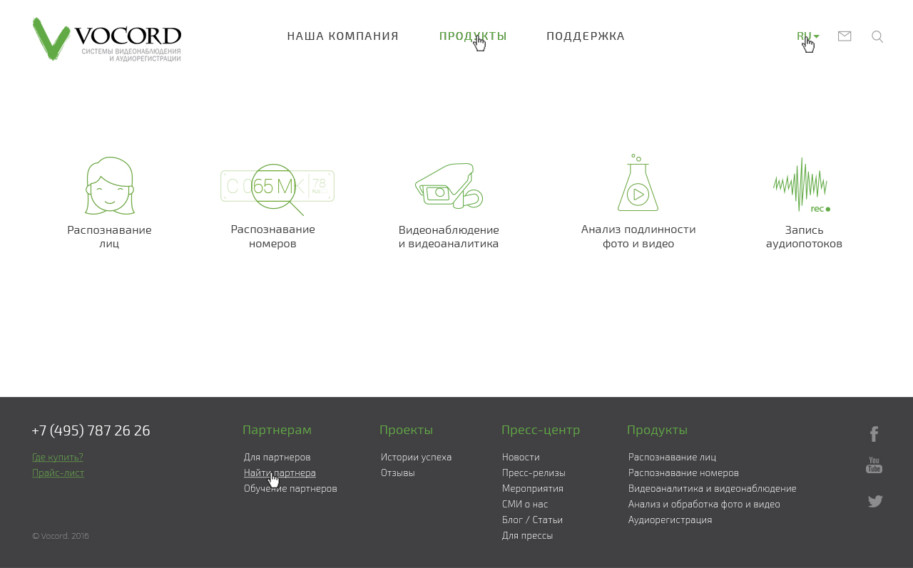

# Vocord
[![Build status][travis-image]][travis-url] [![Dependency status][dependency-image]][dependency-url] [![devDependency status][dev-dependency-image]][dev-dependency-url]

Разработка и производство профессиональных систем безопасности: видеонаблюдение, распознавание лиц 2D и 3D, распознавание номеров, контроль дорожного движения, контроль цифровых и аналоговых телефонных линий, потока Е1, IP-телефонии, автоматическое оповещение.

## Summary
* High Resolution: No
* Compatible Browsers: IE10+, Edge, Firefox, Safari, Opera, Chrome
* Technologies: BEM, LESS, Grunt, HTML5
* Files Included: HTML Files, CSS Files, JS Files, images
* Columns: 12
* Layout: Responsive

## Build
    cd /[path_to_folder]/src/
    npm i  
    npm run build

## File structure
    ROOT FOLDER
    +-- css /
    ¦    +-- bootstrap.css
    ¦    +-- bootstrap.min.css
    ¦    +-- style.css
    ¦    +-- style.min.css
    ¦
    +-- img /
    ¦    +-- catalog /
    ¦    ¦   ¦
    ¦    ¦   +-- catalog__analysis--static.png
    ¦    ¦   +-- catalog__analysis.gif
    ¦    ¦   +-- catalog__audio--static.png
    ¦    ¦   +-- catalog__audio.gif
    ¦    ¦   +-- catalog__faces--static.png
    ¦    ¦   +-- catalog__faces.gif
    ¦    ¦   +-- catalog__number--static.png
    ¦    ¦   +-- catalog__number.gif
    ¦    ¦   +-- catalog__video--static.png
    ¦    ¦   +-- catalog__video.gif
    ¦    ¦
    ¦    +-- feature /
    ¦    ¦   ¦
    ¦    ¦   +-- feature__analysis--tooltip.jpg
    ¦    ¦   +-- feature__analysis.jpg
    ¦    ¦   +-- feature__faces--tooltip.jpg
    ¦    ¦   +-- feature__faces.jpg
    ¦    ¦   +-- feature__number--tooltip.jpg
    ¦    ¦   +-- feature__number.jpg
    ¦    ¦
    ¦    +-- header /
    ¦    ¦   ¦
    ¦    ¦   +-- header__logo.png
    ¦    ¦
    ¦    +-- products /
    ¦    ¦   ¦
    ¦    ¦   +-- analysis /
    ¦    ¦   ¦   ¦
    ¦    ¦   ¦   +-- products--analysis-bg1.png
    ¦    ¦   ¦
    ¦    ¦   +-- audio /
    ¦    ¦   ¦   ¦
    ¦    ¦   ¦   +-- products--audio-bg1.png
    ¦    ¦   ¦   +-- products--audio-bg2.png
    ¦    ¦   ¦
    ¦    ¦   +-- faces /
    ¦    ¦   ¦   ¦
    ¦    ¦   ¦   +-- products--faces-bg1.png
    ¦    ¦   ¦   +-- products--faces-bg2.png
    ¦    ¦   ¦
    ¦    ¦   +-- number /
    ¦    ¦   ¦   ¦
    ¦    ¦   ¦   +-- products--number-bg1.png
    ¦    ¦   ¦   +-- products--number-bg2.png
    ¦    ¦   ¦
    ¦    ¦   +-- adobe.png
    ¦    ¦
    ¦    +-- promo /
    ¦    ¦   ¦
    ¦    ¦   +-- promo__bg.jpg
    ¦    ¦
    ¦    +-- technology /
    ¦    ¦   ¦
    ¦    ¦   +-- analysis /
    ¦    ¦   ¦   ¦
    ¦    ¦   ¦   +-- technology__bg.png
    ¦    ¦   ¦   +-- technology__slides-item--1.png
    ¦    ¦   ¦   +-- technology__slides-item--2a--tooltip.png
    ¦    ¦   ¦   +-- technology__slides-item--2a.png
    ¦    ¦   ¦   +-- technology__slides-item--2b--tooltip.png
    ¦    ¦   ¦   +-- technology__slides-item--2b.png
    ¦    ¦   ¦   +-- technology__slides-item--3.png
    ¦    ¦   ¦
    ¦    ¦   +-- audio /
    ¦    ¦   ¦   ¦
    ¦    ¦   ¦   +-- technology__bg.png
    ¦    ¦   ¦   +-- technology__slider-icon-navigation--bg1.svg
    ¦    ¦   ¦   +-- technology__slider-icon-navigation--bg2.svg
    ¦    ¦   ¦   +-- technology__slider-icon-navigation--bg3.svg
    ¦    ¦   ¦   +-- technology__slides-item--1.png
    ¦    ¦   ¦
    ¦    ¦   +-- faces /
    ¦    ¦   ¦   ¦
    ¦    ¦   ¦   +-- technology__bg.png
    ¦    ¦   ¦   +-- technology__slides-item--1.png
    ¦    ¦   ¦   +-- technology__slides-item--2.png
    ¦    ¦   ¦   +-- technology__slides-item--3.png
    ¦    ¦   ¦
    ¦    ¦   +-- number /
    ¦    ¦       ¦
    ¦    ¦       +-- technology__bg.png
    ¦    ¦       +-- technology__slider-navigation--bg.svg
    ¦    ¦       +-- technology__slider-navigation--mobilebg.svg
    ¦    ¦       +-- technology__slides-item--1.png
    ¦    ¦       +-- technology__slides-item--2.png
    ¦    ¦       +-- technology__slides-item--3.png
    ¦    ¦       +-- technology__slides-item--4.png
    ¦    ¦       +-- technology__slides-item--5.png
    ¦    ¦
    ¦    +-- screenshot.jpg
    ¦
    +-- js /
    ¦    ¦
    ¦    +-- script.js
    ¦
    +-- less /
    ¦   ¦  
    ¦   +-- blocks /
    ¦   ¦   ¦
    ¦   ¦   +-- catalog.less
    ¦   ¦   +-- feature.less
    ¦   ¦   +-- footer.less
    ¦   ¦   +-- header.less
    ¦   ¦   +-- intro.less
    ¦   ¦   +-- main.less
    ¦   ¦   +-- map.less
    ¦   ¦   +-- products.less
    ¦   ¦   +-- promo.less
    ¦   ¦   +-- technology.less
    ¦   ¦   
    ¦   +-- bootstrap /
    ¦   ¦   ¦
    ¦   ¦   +-- alerts.less
    ¦   ¦   +-- badges.less
    ¦   ¦   +-- breadcrumbs.less
    ¦   ¦   +-- button-groups.less
    ¦   ¦   +-- buttons.less
    ¦   ¦   +-- carousel.less
    ¦   ¦   +-- close.less
    ¦   ¦   +-- code.less
    ¦   ¦   +-- component-animations.less
    ¦   ¦   +-- dropdowns.less
    ¦   ¦   +-- forms.less
    ¦   ¦   +-- glyphicons.less
    ¦   ¦   +-- grid.less
    ¦   ¦   +-- input-groups.less
    ¦   ¦   +-- jumbotron.less
    ¦   ¦   +-- labels.less
    ¦   ¦   +-- list-group.less
    ¦   ¦   +-- media.less
    ¦   ¦   +-- mixins.less
    ¦   ¦   +-- modals.less
    ¦   ¦   +-- navbar.less
    ¦   ¦   +-- navs.less
    ¦   ¦   +-- normalize.less
    ¦   ¦   +-- pager.less
    ¦   ¦   +-- pagination.less
    ¦   ¦   +-- panels.less
    ¦   ¦   +-- popovers.less
    ¦   ¦   +-- print.less
    ¦   ¦   +-- progress-bars.less
    ¦   ¦   +-- responsive-embed.less
    ¦   ¦   +-- responsive-utilities.less
    ¦   ¦   +-- scaffolding.less
    ¦   ¦   +-- tables.less
    ¦   ¦   +-- theme.less
    ¦   ¦   +-- thumbnails.less
    ¦   ¦   +-- tooltip.less
    ¦   ¦   +-- type.less
    ¦   ¦   +-- utilities.less
    ¦   ¦   +-- variables.less
    ¦   ¦   +-- wells.less
    ¦   ¦   +-- mixins /
    ¦   ¦       ¦
    ¦   ¦       +-- alerts.less
    ¦   ¦       +-- background-variant.less
    ¦   ¦       +-- border-radius.less
    ¦   ¦       +-- buttons.less
    ¦   ¦       +-- center-block.less
    ¦   ¦       +-- clearfix.less
    ¦   ¦       +-- forms.less
    ¦   ¦       +-- gradients.less
    ¦   ¦       +-- grid-framework.less
    ¦   ¦       +-- grid.less
    ¦   ¦       +-- hide-text.less
    ¦   ¦       +-- image.less
    ¦   ¦       +-- labels.less
    ¦   ¦       +-- list-group.less
    ¦   ¦       +-- nav-divider.less
    ¦   ¦       +-- nav-vertical-align.less
    ¦   ¦       +-- opacity.less
    ¦   ¦       +-- pagination.less
    ¦   ¦       +-- panels.less
    ¦   ¦       +-- progress-bar.less
    ¦   ¦       +-- reset-filter.less
    ¦   ¦       +-- reset-text.less
    ¦   ¦       +-- resize.less
    ¦   ¦       +-- responsive-visibility.less
    ¦   ¦       +-- size.less
    ¦   ¦       +-- tab-focus.less
    ¦   ¦       +-- table-row.less
    ¦   ¦       +-- text-emphasis.less
    ¦   ¦       +-- text-overflow.less
    ¦   ¦       +-- vendor-prefixes.less
    ¦   ¦   
    ¦   +-- general /
    ¦   ¦   ¦
    ¦   ¦   +-- global.less
    ¦   ¦   +-- variables.less
    ¦   ¦
    ¦   +-- bootstrap.less
    ¦   +-- style.less
    ¦
    +-- .csscomb.json
    +-- .editorconfig
    +-- .gitignore
    +-- .travis.yml
    +-- Gruntfile.js
    +-- README.md
    +-- package.json
    +-- analysis.html
    +-- audio.html
    +-- faces.html
    +-- index.html
    +-- number.html
    +-- video.html

[travis-image]: https://travis-ci.org/mayer-web/vocord.svg?branch=master
[travis-url]: https://travis-ci.org/mayer-web/vocord

[dependency-image]: https://david-dm.org/mayer-web/vocord.svg?style=flat-square
[dependency-url]: https://david-dm.org/mayer-web/vocord

[dev-dependency-image]: https://david-dm.org/mayer-web/vocord/dev-status.svg?style=flat-square
[dev-dependency-url]: https://david-dm.org/mayer-web/vocord#info=devDependencies
